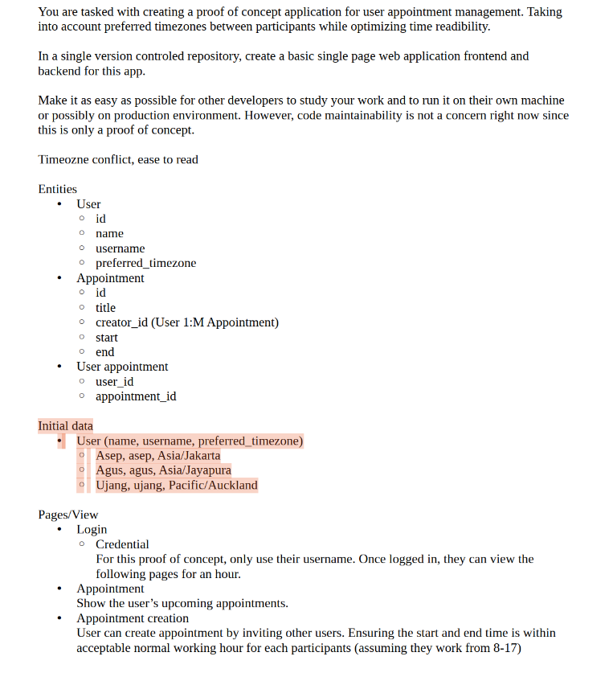

# Test FULLSTACK HEALMITY

Soal


## Getting Started

### Dependencies

- required Nodejs & PostgreSQL

### Installing

Install pnpm

```bash
npm install -g pnpm
```

Navigate to the server directory:

```bash
cd server
```

install all dependencies:

```bash
pnpm install
```

### Executing program

1. Create database:

```bash
pnpm run create
```

2. Run migrations:

```bash
pnpm run migrate
```

3. Seed the database:

```bash
pnpm run seed
```

4. Run the API server

```bash
node app.js
```

or if you have installed nodemon, run:

```bash
pnpm run dev
```

Add new terminal to the client directory:

```bash
cd client
```

install all dependencies:

```bash
pnpm install
```

```bash
pnpm run dev
```

# Page Documentation

The documentation page can be viewed at http://localhost:5173/docs
